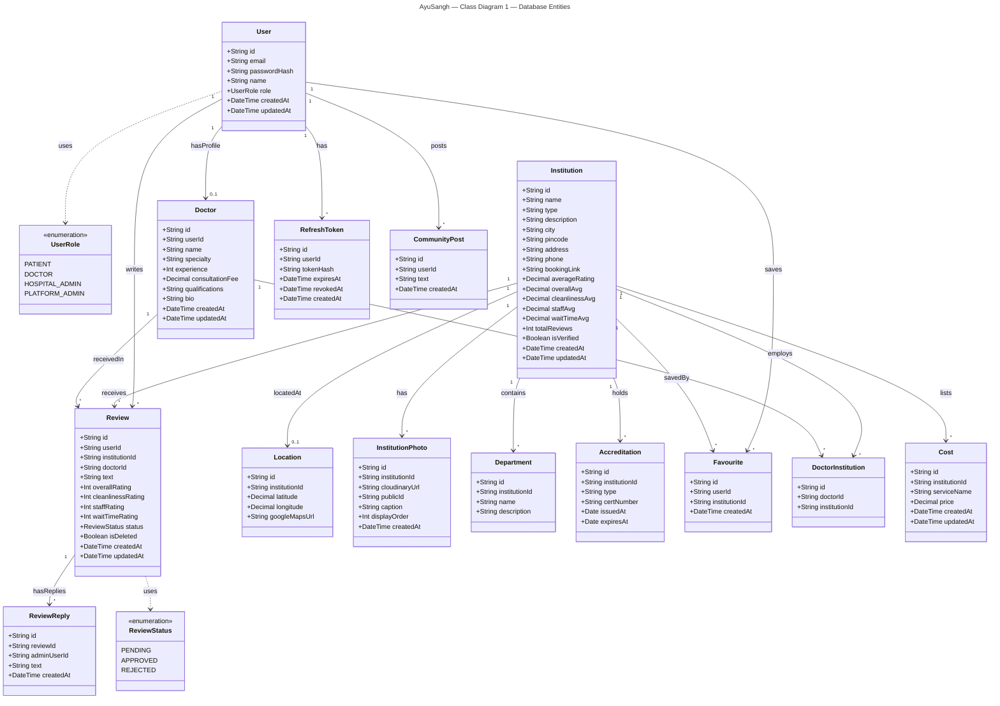

# AyuSangh — Class Diagrams (Mermaid)

---

## Class Diagram 1 — Database Entities (Prisma Schema) -> https://mermaid.ai/d/ee3b7193-f155-4978-8dd4-81b74c10acfc

---

## Class Diagram 2 — NestJS Modules (Controller → Service → Repository) -> https://mermaid.ai/d/011c267e-52f2-4f7a-8d98-c960789593af

```mermaid
---
title: AyuSangh — Class Diagram 2 — NestJS Modules
---
classDiagram
    direction LR

    %% ─── AUTH MODULE ───
    class AuthController {
        <<Controller>>
        +registerPatient(dto RegisterUserDto) RegisteredUserView
        +registerHospital(dto RegisterHospitalDto) RegisteredUserView
        +login(req AuthRequest) AuthTokens
        +refresh(dto RefreshDto) AuthTokens
        +logout(req AuthRequest) void
    }

    class AuthService {
        <<Service>>
        +registerPatient(dto RegisterUserDto) RegisteredUserView
        +registerHospital(dto RegisterHospitalDto) RegisteredUserView
        +validateUser(email String, password String) AuthUser
        +login(user AuthUser) AuthTokens
        +refreshTokens(refreshToken String) AuthTokens
        +logout(userId String, refreshToken String) void
        -generateTokens(user AuthUser) AuthTokens
        -persistRefreshToken(userId String, token String) void
    }

    class UsersService {
        <<Service>>
        +findOneByEmail(email String) User
        +findOneById(id String) User
        +createPatient(dto RegisterUserDto) User
        +createHospitalAdmin(dto RegisterHospitalDto) User
    }

    class JwtStrategy {
        <<Strategy>>
        +validate(payload JwtPayload) AuthUser
    }

    class LocalStrategy {
        <<Strategy>>
        +validate(email String, password String) AuthUser
    }

    class JwtAuthGuard {
        <<Guard>>
        +canActivate(context ExecutionContext) Boolean
    }

    class RolesGuard {
        <<Guard>>
        +canActivate(context ExecutionContext) Boolean
    }

    %% ─── HOSPITAL MODULE ───
    class HospitalController {
        <<Controller>>
        +search(dto SearchHospitalDto) Institution[]
        +getProfile(id String) Institution
        +register(dto CreateHospitalDto) Institution
        +update(id String, dto UpdateHospitalDto) Institution
        +uploadPhoto(id String, file File) InstitutionPhoto
        +deletePhoto(id String, photoId String) void
        +addToFavourites(id String) Favourite
        +removeFromFavourites(id String) void
        +isFavourite(id String) Boolean
        +getMyFavourites() Favourite[]
    }

    class HospitalService {
        <<Service>>
        +search(dto SearchHospitalDto) Institution[]
        +getProfile(id String) Institution
        +register(dto CreateHospitalDto, userId String) Institution
        +update(id String, dto UpdateHospitalDto, userId String) Institution
    }

    class HospitalRepository {
        <<Repository>>
        +searchByFilters(name String, city String, type String) Institution[]
        +findWithDetails(id String) Institution
        +updateRatings(id String, ratings Object) Institution
    }

    class FavouritesService {
        <<Service>>
        +addToFavourites(userId String, hospitalId String) Favourite
        +removeFromFavourites(userId String, hospitalId String) void
        +getUserFavourites(userId String) Favourite[]
        +isFavourite(userId String, hospitalId String) Boolean
    }

    %% ─── REVIEW MODULE ───
    class ReviewController {
        <<Controller>>
        +getHospitalReviews(id String) Review[]
        +getDoctorReviews(id String) Review[]
        +submitReview(dto SubmitReviewDto) Review
        +editReview(id String, dto UpdateReviewDto) Review
        +deleteReview(id String) void
        +getPendingReviews() Review[]
        +approveReview(id String) Review
        +rejectReview(id String) Review
        +adminReply(id String, dto ReplyReviewDto) ReviewReply
    }

    class ReviewService {
        <<Service>>
        +submitReview(userId String, dto SubmitReviewDto) Review
        +updateReview(id String, userId String, dto UpdateReviewDto) Review
        +deleteReview(id String, userId String, isAdmin Boolean) void
        +approveReview(id String) Review
        +rejectReview(id String) Review
        +replyToReview(reviewId String, text String, adminUserId String) ReviewReply
        +recalculateRatings(hospitalId String) void
        +getHospitalReviews(hospitalId String) Review[]
        +getPendingReviews() Review[]
    }

    class ReviewRepository {
        <<Repository>>
        +findByHospital(hospitalId String) Review[]
        +findByDoctor(doctorId String) Review[]
        +findDuplicate(userId String, hospitalId String) Review
        +findPending() Review[]
        +updateStatus(id String, status ReviewStatus) Review
        +addReply(reviewId String, text String, adminUserId String) ReviewReply
    }

    %% ─── DOCTOR MODULE ───
    class DoctorController {
        <<Controller>>
        +searchDoctors(specialization String) Doctor[]
        +getDoctorProfile(id String) Doctor
        +registerDoctor(dto RegisterDoctorDto) Doctor
        +updateProfile(id String, dto UpdateDoctorDto) Doctor
        +linkToHospital(doctorId String, hospitalId String) DoctorInstitution
        +unlinkFromHospital(doctorId String, hospitalId String) void
    }

    class DoctorService {
        <<Service>>
        +searchDoctors(specialization String) Doctor[]
        +getDoctorProfile(id String) Doctor
        +registerDoctor(userId String, dto RegisterDoctorDto) Doctor
        +updateProfile(id String, userId String, dto UpdateDoctorDto) Doctor
        +linkToHospital(doctorId String, hospitalId String) DoctorInstitution
        +unlinkFromHospital(doctorId String, hospitalId String) void
    }

    class DoctorRepository {
        <<Repository>>
        +searchBySpecialization(query String) Doctor[]
        +findWithInstitutions(id String) Doctor
        +linkToHospital(doctorId String, hospitalId String) DoctorInstitution
        +unlinkFromHospital(doctorId String, hospitalId String) void
    }

    %% ─── SEARCH MODULE ───
    class SearchController {
        <<Controller>>
        +globalSearch(q String) SearchResult
        +advancedHospitalSearch(options Object) Institution[]
        +advancedDoctorSearch(options Object) Doctor[]
        +findNearby(lat Float, lng Float) Institution[]
        +getTrendingSearches() String[]
    }

    class SearchService {
        <<Service>>
        -cache Map
        +globalSearch(query String) SearchResult
    }

    class AdvancedSearchService {
        <<Service>>
        +advancedHospitalSearch(options Object) Institution[]
        +advancedDoctorSearch(options Object) Doctor[]
        +findNearby(lat Float, lng Float, radiusKm Float) Institution[]
        +getTrendingSearches() String[]
    }

    %% ─── COMMUNITY MODULE ───
    class CommunityController {
        <<Controller>>
        +getAllPosts() CommunityPost[]
        +createPost(dto CreatePostDto) CommunityPost
    }

    class CommunityService {
        <<Service>>
        +getAllPosts() CommunityPost[]
        +createPost(userId String, dto CreatePostDto) CommunityPost
    }

    class CommunityRepository {
        <<Repository>>
        +findAll() CommunityPost[]
        +create(data Object) CommunityPost
    }

    %% ─── COST MODULE ───
    class CostController {
        <<Controller>>
        +getCosts(institutionId String) Cost[]
        +addCost(institutionId String, dto CreateCostDto) Cost
        +deleteCost(institutionId String, costId String) void
    }

    class CostService {
        <<Service>>
        +getCosts(institutionId String) Cost[]
        +addCost(institutionId String, dto CreateCostDto) Cost
        +deleteCost(institutionId String, costId String) void
    }

    class CostRepository {
        <<Repository>>
        +findByInstitution(institutionId String) Cost[]
        +create(data Object) Cost
        +delete(id String) Cost
    }

    %% ─── MODULE RELATIONSHIPS ───
    AuthController --> AuthService : injects
    AuthService --> UsersService : injects
    JwtAuthGuard --> JwtStrategy : uses
    LocalStrategy --> AuthService : injects

    HospitalController --> HospitalService : injects
    HospitalController --> FavouritesService : injects
    HospitalService --> HospitalRepository : injects

    ReviewController --> ReviewService : injects
    ReviewService --> ReviewRepository : injects
    ReviewService --> HospitalRepository : injects

    DoctorController --> DoctorService : injects
    DoctorService --> DoctorRepository : injects

    SearchController --> SearchService : injects
    SearchController --> AdvancedSearchService : injects

    CommunityController --> CommunityService : injects
    CommunityService --> CommunityRepository : injects

    CostController --> CostService : injects
    CostService --> CostRepository : injects
```

---

## Class Diagram 3 — Design Patterns (Strategy + Repository + Guards) -> https://mermaid.ai/d/7084b34c-a28a-464c-a054-e8f907b79aae

```mermaid
---
title: AyuSangh — Class Diagram 3 — Design Patterns
---
classDiagram
    direction TB

    %% ─── STRATEGY PATTERN ───
    class IRatingStrategy {
        <<interface>>
        +calculateAverage(reviews Review[]) AggregatedRating
    }

    class AggregatedRating {
        <<interface>>
        +overall Float
        +cleanliness Float
        +staffBehaviour Float
        +waitTime Float
        +totalReviews Int
    }

    class DefaultRatingStrategy {
        +calculateAverage(reviews Review[]) AggregatedRating
    }

    class HospitalRatingStrategy {
        +calculateAverage(reviews Review[]) AggregatedRating
    }

    class LabRatingStrategy {
        +calculateAverage(reviews Review[]) AggregatedRating
    }

    class RatingContext {
        -strategies Map
        -defaultStrategy DefaultRatingStrategy
        +register(type String, strategy IRatingStrategy) void
        +calculate(reviews Review[], type String) AggregatedRating
    }

    note for HospitalRatingStrategy "Weights:\nCleanliness 30%\nStaff 30%\nWaitTime 20%\nOverall 20%"
    note for LabRatingStrategy "Weights:\nOverall 40%\nStaff 30%\nWaitTime 20%\nCleanliness 10%"
    note for DefaultRatingStrategy "Simple arithmetic\nmean of all 4 fields"

    IRatingStrategy <|.. DefaultRatingStrategy : implements
    IRatingStrategy <|.. HospitalRatingStrategy : implements
    IRatingStrategy <|.. LabRatingStrategy : implements
    IRatingStrategy --> AggregatedRating : returns
    RatingContext --> IRatingStrategy : uses
    RatingContext --> DefaultRatingStrategy : fallback

    %% ─── REPOSITORY PATTERN ───
    class BaseRepository {
        <<abstract>>
        #db DatabaseService
        +findById(id String) T
        +findAll() T[]
        +create(data CreateInput) T
        +update(id String, data UpdateInput) T
        +delete(id String) T
    }

    class DatabaseService {
        <<Service>>
        +onModuleInit() void
        +onModuleDestroy() void
    }

    class HospitalRepository {
        +searchByFilters(name String, city String, type String) Institution[]
        +findWithDetails(id String) Institution
        +updateRatings(id String, ratings Object) Institution
    }

    class ReviewRepository {
        +findByHospital(hospitalId String) Review[]
        +findDuplicate(userId String, hospitalId String) Review
        +findPending() Review[]
        +updateStatus(id String, status ReviewStatus) Review
        +addReply(reviewId String, text String, adminId String) ReviewReply
    }

    class DoctorRepository {
        +searchBySpecialization(query String) Doctor[]
        +findWithInstitutions(id String) Doctor
        +linkToHospital(doctorId String, hospitalId String) DoctorInstitution
    }

    class CommunityRepository {
        +findAll() CommunityPost[]
        +create(data Object) CommunityPost
    }

    class CostRepository {
        +findByInstitution(institutionId String) Cost[]
        +create(data Object) Cost
    }

    BaseRepository <|-- HospitalRepository : extends
    BaseRepository <|-- ReviewRepository : extends
    BaseRepository <|-- DoctorRepository : extends
    BaseRepository <|-- CommunityRepository : extends
    BaseRepository <|-- CostRepository : extends

    DatabaseService <-- HospitalRepository : injects
    DatabaseService <-- ReviewRepository : injects
    DatabaseService <-- DoctorRepository : injects
    DatabaseService <-- CommunityRepository : injects
    DatabaseService <-- CostRepository : injects

    %% ─── AUTH GUARDS ───
    class JwtAuthGuard {
        <<Guard>>
        +canActivate(context ExecutionContext) Boolean
    }

    class RolesGuard {
        <<Guard>>
        +canActivate(context ExecutionContext) Boolean
    }

    class JwtStrategy {
        <<Strategy>>
        +validate(payload JwtPayload) AuthUser
    }

    class LocalStrategy {
        <<Strategy>>
        +validate(email String, password String) AuthUser
    }

    class CloudinaryService {
        <<Service>>
        +uploadImage(file MulterFile) UploadResult
        +deleteImage(publicId String) void
    }

    JwtAuthGuard --> JwtStrategy : uses

    %% ─── REVIEW SERVICE uses STRATEGY ───
    class ReviewService {
        <<Service>>
        +submitReview(userId String, dto SubmitReviewDto) Review
        +recalculateRatings(hospitalId String) void
        +approveReview(id String) Review
    }

    ReviewService --> RatingContext : injects
    ReviewService --> ReviewRepository : injects
    ReviewService --> HospitalRepository : injects
```

---

