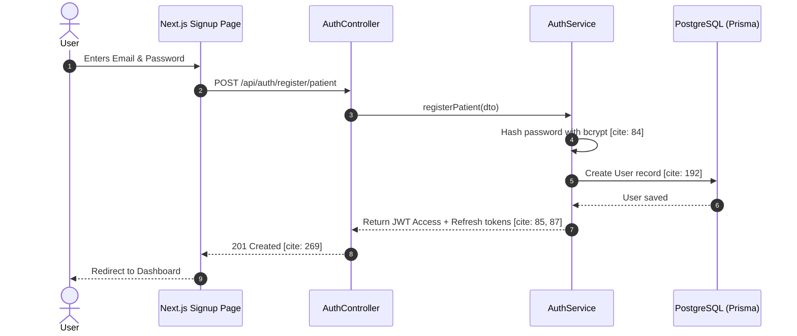
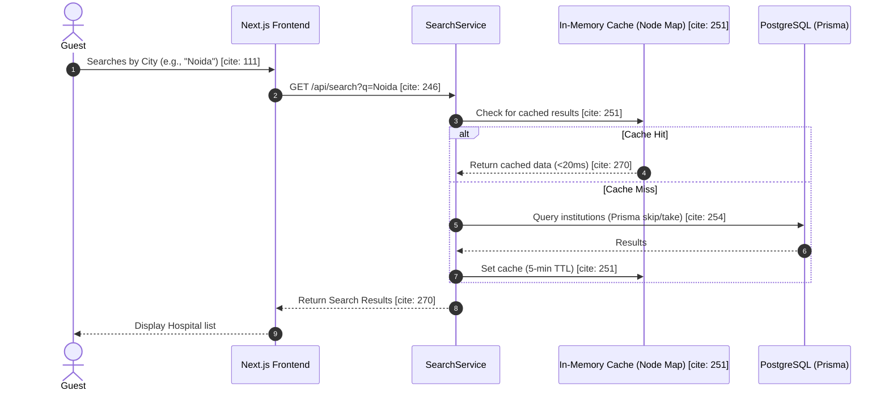
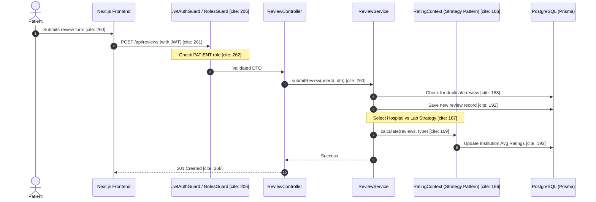

## The Authentication Flow (Security)

This diagram illustrates the process of Registration and Login 

## The Search Flow (Performance)

This diagram illustrates the performance-critical path of the application. 

## The Review Submission Flow (Logic & SOLID)

This diagram, illustrates the Core Business Logic.

